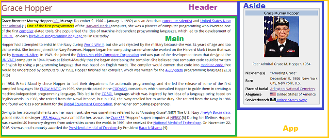

# Grace Hopper con React
***
Sitio web de la biografía de Grace Hopper usando componentes de React.

## Proceso:
1. Se crea la carpeta instalando de manera global create-react-app para ello se tiene que ejecutar los siguientes comandos.

```
npm create-react-app

create-react-app nombre-de-tu-proyecto

cd nombre-de-tu-proyecto

npm start
```

2. Después se identifica los componentes, en el presente proyecto se identificó 4; el app, el header, el main y el aside como se puede ver en la siguiente imagen.



3. Finalmente se crea las carpetas por cada componente donde contendrá el archivo js y su css; además en el archivo js se desarrolló con JSX.


## Demo: 


